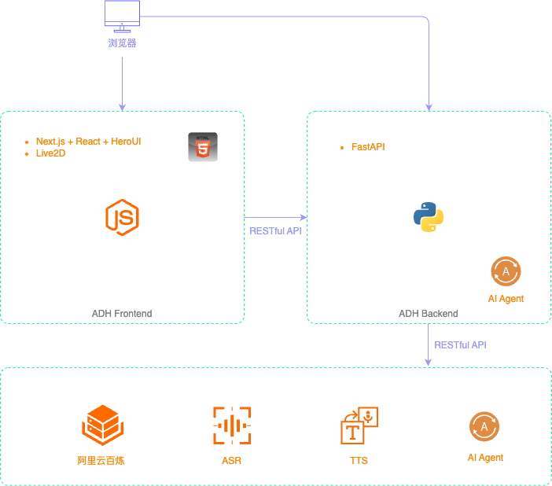
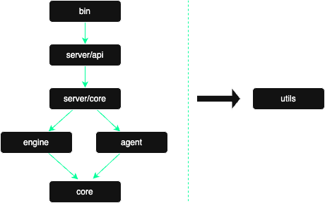
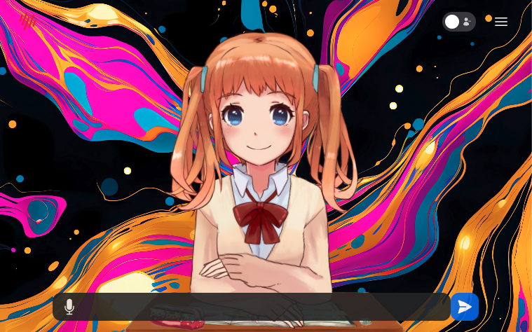

<style>
h1 {
  font-size: 24px;
}

h2 {
  font-size: 20px;
}

h3 {
  font-size: 16px;
}

h4 {
  font-size: 14px;
}

body {
  font-size: 14px;
}

highlight-orange {
  color: #FF8906;
  font-weight: bold;
}

highlight-purple {
  color: #FF00FF;
  font-weight: bold;
}

blockquote {
  font-size: 14px;
}

img {
  border-radius:10px;
}
</style>

LLM 开源社区现有状态，非常活跃，大家开发 AI 原生应用时，可以参考选择。请以最新数据为准。

带着兴趣和疑问来听这个分享。分享完后，期待能够动手实践。

## 开源 LM

### 国内

- 阿里云 <highlight-orange>Qwen3</highlight-orange>，多模态 Qwen 2.5 VL, Qwen2.5-Omni
- <highlight-orange>DeepSeek-R1(0528)</highlight-orange>, DeepSeek-V3, 多模态目前还未有
- 智谱 AI GLM-4，多模态 VisualGLM-6B, CogVLM-17B
- 腾讯云 Hunyuan-MoE-A52B，多模态 Hunyuan-DiT，Hunyuan3D 2.0

### 国外

- Meta Llama4, 多模态 Llama4, Llama 4 Scout, Llama 4 Maverick
- Mistral Small 3.1, 多模态 Mistral Small 3.1
- Google Gemma3, 多模态 Gemma3
- xAI Grok-1, Grok-2, 多模态目前还未有

## 开源 LM 发布平台

- [Hugging Face Hub](https://huggingface.co/models)
- [ModelScope](https://www.modelscope.cn/models)
- [Ollama](https://ollama.com/search)

## 开源 LM 部署工具

| 主流 LM 部署工具                                 | 其它 LM 部署工具                                           |
| :--------------------------------------------- | :------------------------------------------------------- |
| - [Ollama](https://github.com/ollama/ollama)   | - [llama.cpp](https://github.com/ggml-org/llama.cpp)     |
| - [vLLM](https://github.com/vllm-project/vllm) | - [llamafile](https://github.com/Mozilla-Ocho/llamafile) |
| - [Hugging Face Transformers](https://github.com/huggingface/transformers) | - [GPT4All](https://github.com/nomic-ai/gpt4all)         |
|                                                | - [SGLang](https://github.com/sgl-project/sglang)        |
|                                                | - [WebLLM](https://github.com/mlc-ai/web-llm)            |
|                                                | - [LightLLM](https://github.com/ModelTC/lightllm)        |
|                                                | - [BitNet](https://github.com/microsoft/BitNet)          |

## 开源 AI Agent 开发框架

> 2024 年 AI Agent 开发领域以开源社区为主，2025 年大厂开始发力，在我看来，AI Agent 开发框架会以开源社区为主。
> [Azure AI Foundry Agent Service](https://learn.microsoft.com/en-us/azure/ai-foundry/agents/overview) 是一个将模型、工具、框架和治理机制整合为统一平台的系统，用于构建智能体。

| 通⽤ AI Agent 开发框架 |          RAG 开发框架    |  低代码开发⼯具            |   类 Manus 开发框架   |
| :--------------------| :---------------------- | :---------------------- | :------------------ |
| - [LangChain + LangGraph](https://github.com/langchain-ai/langgraph) | - [LlamaIndex](https://github.com/run-llama/llama_index) | - [Dify](https://github.com/langgenius/dify) | - [OpenManus](https://github.com/FoundationAgents/OpenManus) |
| - [CrewAI](https://github.com/crewAIInc/crewAI) | - [GraphRAG](https://github.com/microsoft/graphrag) | - [FastGPT](https://github.com/labring/FastGPT) | - [OWL](https://github.com/camel-ai/owl) |
| - [Agent SDK](https://github.com/openai/openai-agents-python) | - [LangChain-Chatchat](https://github.com/chatchat-space/Langchain-Chatchat) | - [Flowise](https://github.com/FlowiseAI/Flowise) | - [Minion-Agent](https://github.com/femto/minion-agent) |
| - [AutoGPT Platform](https://github.com/Significant-Gravitas/AutoGPT) |    | - [n8n](https://github.com/n8n-io/n8n) |
| - [AutoGen](https://github.com/microsoft/autogen)                     |    |   |   |
| - [MetaGPT](https://github.com/FoundationAgents/MetaGPT)              |    |   |   |
| - [Camel](https://github.com/camel-ai/camel)                          |    |   |   |
| - [BabyAGI](https://github.com/yoheinakajima/babyagi)                 |    |   |   |
| - [AutoAgents](https://github.com/Link-AGI/AutoAgents)                |    |   |   |
| - [Google- ADK](https://google.github.io/adk-docs/)                   |    |   |   |
| - [AWS - Strands Agents](https://strandsagents.com/latest/)           |    |   |   |

## 开源数字人项目

| ⾮实时数字⼈               | 2D 实时数字人   | 3D 实时数字人 |
| :----------------------- | :------------ | :---------- |
| - [EchoMimic V2](https://github.com/antgroup/echomimic_v2) | - [ADH](https://github.com/wan-h/awesome-digital-human-live2d) | - [阿里达摩院 OpenAvatarChat](https://github.com/HumanAIGC-Engineering/OpenAvatarChat)<br>[Playground](https://www.openavatarchat.ai/playground) |
| - [Heygem](https://github.com/duixcom/Duix.Heygem)         | - [LiveTalking](https://github.com/lipku/livetalking) | - [VideoChat](https://github.com/Henry-23/VideoChat) |
| - [Sonic](https://github.com/jixiaozhong/Sonic)            | - [Ultralight-Digital-Human](https://github.com/anliyuan/Ultralight-Digital-Human)<br>(2.5D - AI 模型实时生成) |
| - [LivePortrait](https://github.com/KwaiVGI/LivePortrait)  |  |  |
| - [Fay](https://github.com/xszyou/fay)                     |  |  |
| - [SadTalker](https://github.com/OpenTalker/SadTalker)     |  |  |
| - [LatentSync](https://github.com/bytedance/LatentSync)    |  |  |
| - [JoyGen](https://github.com/JOY-MM/JoyGen)               |  |  |

## 商业 3D 数字人

- [Nvidia ACE](https://blogs.nvidia.cn/blog/digital-humans-ace-generative-ai-microservices/)

    <highlight-orange>Nvidia ACE</highlight-orange> 是目前最为逼真的数字人服务，支持实时交互。当然，价格不菲。视频中展示了非常多的应用场景，还有 [在线 demo](https://build.nvidia.com/nvidia/digital-humans-for-customer-service) 可以体验。

    [B 站上更完整的 Nvidia 数字人演示视频](https://www.bilibili.com/video/BV1Dz42187yB/)

    <BiliBili bvid="BV1Dz42187yB" />

- [Metahuman](https://www.metahuman.com/en-US)。创建并驱动完全定制的高度逼真 3D 数字人。

## <highlight-orange>ADH 2D 实时数字人</highlight-orange>

开源项目 [awesome-digital-human-live2d](https://github.com/wan-h/awesome-digital-human-live2d)，缩写为 ADH，是国内优秀开发者<highlight-orange>一力辉</highlight-orange>老师在 2024 年开发的。ADH 项目分成后端和前端两部分。<highlight-orange>后端使用 Python 开发，开发框架是 FastAPI。前端使用 TypeScript 开发，开发框架是 Next.js + React + HeroUI</highlight-orange>。可以本地部署开源大模型，也可以使用[阿里云百炼模型广场](https://bailian.console.aliyun.com/?tab=model#/model-market)。



### 部署 ADH 前后端

<highlight-purple>后端 (Ubuntu 22.04/24.04):</highlight-purple>

ADH 后端就是一个基于 FastAPI 开发的服务，它的主要作用是集成外部的一些基础服务（包括 ASR、TTS、LLM 三类）和外部的 AI Agent，暴露 RESTful API 给前端使用。ADH 前端遵循 BFF 架构模式（Backend for Frontend），而支持 BFF 架构前端的理想选择就是微服务，主要是基于 RESTful API 的微服务。而使用 Python 开发微服务的首选开发框架就是 FastAPI。

ADH 后端按照目录结构呈现微单向依赖关系，代码采用标准的 OOP 面向对象风格编写。



ADH 后端部署的步骤：

```bash
# Python 3.10 on 22.04 and Python 3.12 on 24.04 by default
sudo apt install python3 python3-pip python3-dev
curl -LsSf https://astral.sh/uv/install.sh | sh

# FFmpeg
sudo apt update
sudo apt install ffmpeg

# Clone ADH
cd ~
git clone https://github.com/wan-h/awesome-digital-human-live2d.git
cd awesome-digital-human-live2d
# Init a uv project
uv init --python 3.10

# Update `pyproject.toml` to use Tsinghua University's PyPI mirror
# Add the following section at the beginning of the file:
# [[tool.uv.index]]
# url = "https://pypi.tuna.tsinghua.edu.cn/simple"
# default = true

# Install dependencies
uv add $(cat requirements.txt)

# Create the main config file (port: 8002)
cd configs
cp config_template.yaml config.yaml

# Run the ADH backend server
cd ~/awesome-digital-human-live2d
uv run python main.py
```

<highlight-purple>前端 (MacOS):</highlight-purple>

ADH 前端是一个标准的 H5 页面，而且支持被内嵌在其他 H5 页面中，例如微信小程序。Next.js 应用的架构遵循标准的 BFF（Backend for Frontend）架构模式。

```bash
# Install Node.js(v22.16.0) https://nodejs.org/en/download

npm install -g next
npm install -g heroui-cli
corepack enable pnpm

# Clone ADH
cd
git clone https://github.com/wan-h/awesome-digital-human-live2d.git
cd awesome-digital-human-live2d/web

# Install dependencies
pnpm install

# Update frontend configs
# NEXT_PUBLIC_SERVER_IP="<ADH backend server IP>"
# NEXT_PUBLIC_SERVER_PORT="<ADH backend server port>"
copy .env_template .env

# Run the ADH frontend server
pnpm run build
pnpm run start
```

<highlight-purple>测试 ADH 2D 实时数字人:</highlight-purple>

在 UI 设置界面配置 AI Agent，引擎选择 "OpenAI"，引擎配置我用的是阿里云百炼模型广场的 `qwen3-8b`。TTS 默认使用的免费服务是 [EdgeTTS](https://edge-tts.com/)，点击这个链接可以体验。



### 使用 Agent SDK 开发 AI Agent 对接 ADH

目前 ADH 后端已经实现了与 Dify、FastGPT 开发的 AI Agent 的对接。我们将实现与 Agent SDK 开发的 AI Agent 的对接。下文提到的外部 AI Agent 的代码文件在 GitHub 仓库 [adh-ai-agent](https://github.com/JoneyXiao/adh-ai-agent) 中。

[Agent SDK](https://openai.github.io/openai-agents-python/) 是 OpenAI 在 [2025 年 3 月 11 号](https://openai.com/index/new-tools-for-building-agents/)发布的轻量级 AI Agent 开发框架。[OpenAI Agents SDK 中文文档](https://www.tizi365.com/openai-agents-sdk/)。

> OpenAI 在 2025 年 3 月 11 号发布的 Responses API，计划在明年全面取代 Assistants API。
> 
> [openai-cs-agents-demo](https://github.com/openai/openai-cs-agents-demo) 是一个基于 OpenAI Agents SDK 构建的客户服务智能体演示项目，包含 Python 后端智能体编排引擎和 Next.js 前端交互界面。项目完整复现了航空公司客服场景：通过分流智能体（Triage Agent）将用户请求（如改签座位、航班状态查询）自动路由到专业智能体（座位预订/航班状态/FAQ 等模块），并集成了安全护栏机制（防越狱/防无关问题）。用户可通过直观的聊天界面体验多智能体协同处理复杂工作流的全过程，后端采用模块化设计便于自定义提示词和业务逻辑扩展。

Agent SDK 中包括以下三个基本概念：

- <highlight-orange>Agent（代理）：配备指令和工具的一个 LLM 会话（session）。</highlight-orange>
- <highlight-orange>Handoff（移交）：允许一个代理委托其他代理来执行特定任务(多 Agent 协作)。</highlight-orange>
- <highlight-orange>Guardrail（护栏）：对代理的输入、输出进行校验。</highlight-orange>

在 Agent SDK 的实现中，是基于 Assistants API 来调用配置的 Tools，Tools 可以是 Python 函数，还可以是另外一个 Agent。如果要调用 Tools，就必须使用支持 Assistants API（也就是所谓的“Function Call”）的 LLM。Qwen3 对 Assistants API 支持的非常好，而 DeepSeek-R1 则完全不支持 Assistants API，支持 Assistants API 的是 DeepSeek-V3。DeepSeek-V3 和 DeepSeek-R1 必须结合起来才能开发调用 Tools 的 AI Agent。

多 Agent 协作的基础就是角色扮演（role playing），角色扮演的基础是在大模型层面，而不是在 AI Agent 开发框架层面，现在主流的大模型都支持角色扮演。

回到 ADH 项目，AI Agent 的功能通常都特定于具体的需求，因此 AI Agent 应该与通用的 ADH 分隔开。在后端服务器上面创建一个新的 Python 项目，该项目作为一个 Python 库，添加为 ADH 的依赖。这是一种最简单的实现方式，还可以使用 RESTful API 调用的方式。

```bash
cd
uv init --python 3.10 adh-ai-agent
cd adh-ai-agent

# Add agent sdk as a dependency
uv add openai-agents

# This is the name of the Python package
mkdir adh_ai_agent
```

更新 `pyproject.toml` 文件，使用 `setuptools` 作为构建系统，把 adh-ai-agent 项目作为一个 Python 库，以便于通过 pip 安装。

```toml
[[tool.uv.index]]
url = "https://pypi.tuna.tsinghua.edu.cn/simple"
default = true

[build-system]
requires = ["setuptools>=42"]
build-backend = "setuptools.build_meta"
```

切换到 ADH 项目的根目录。

```bash
cd ~/awesome-digital-human-live2d
```

更新 ADH 项目的 `pyproject.toml` 文件，添加 `editable_mode` 配置，以便于在开发过程中，自动更新依赖的包。

```toml
[tool.uv]
config-settings = { editable_mode = "compat" }
```

添加 `adh-ai-agent` 作为 ADH 的依赖。这样当依赖项目的代码修改之后，ADH 可以立即使用最新的代码。

```bash
uv pip install -e "../adh-ai-agent"
```

到这里，一个 AI Agent 项目的初始化工作就完成了。接下来开发一个 ADH agent 类来支持调用上一步创建的外部 AI Agent。`digitalHuman/agent/core/repeaterAgent.py` 是一个最简单的 ADH Agent 实现，它重复输出用户输入的内容，可以作为模板开发一个新的 ADH Agent `digitalHuman/agent/core/outsideAgent.py`。

> 在 `run()` 函数中，使用 `importlib.import_module(AGENT_MODULE)` 动态加载外部 AI Agent 的模块，调用了模块的 `chat_with_agent()` 函数。
> 
> 还需要把新创建的 ADH Agent 添加到 `digitalHuman/agent/core/__init__.py` 文件中。然后在 `configs/agents/` 目录下创建一个新文件 `outsideAgent.yaml`，添加新 ADH Agent 的配置。
> 
> 最后，在主配置文件 `configs/config.yaml` 中，把新的 ADH Agent 配置文件名 `outsideAgent.yaml` 添加到 `SERVER.AGENTS.SUPPORT_LIST` 列表中。

### 角色扮演 - 花木兰

AI Agent 实现<highlight-orange>花木兰</highlight-orange>的角色扮演，对应的代码文件是 `adh-ai-agent/adh_ai_agent/mulan.py`。准备 `.env` 文件。

```bash
# 在 adh-ai-agent 项目根目录下创建 .env 文件
cp .env.template .env

# 在 .env 文件中添加 API_KEY
API_KEY=your_openai_api_key
```

然后在 ADH 前端设置页面，配置新的 AI 智能体，引擎选择 "OutsideAgent"，引擎配置中 agent_type 设置为默认的 "local_lib"，agent_module 设置为 `adh_ai_agent.mulan`。

### 数字人形象定制

ADH 前端使用的 2D 数字人，是基于 Live2D 开发的。基于 Live2D 的 2D 数字人模型，可以划分为设计（也就是建模）和应用两个大的环节。

- <highlight-orange>设计环节</highlight-orange>：使用 Live2D Editor 来进行 2D 数字人的设计。设计的成品会被导出为 Live2D 模型。设计环节的主要工作由设计师来完成。
- <highlight-orange>应用环节</highlight-orange>：使用 Live2D SDK 将设计环节中导出的 Live2D 模型部署到各种应用之中。应用环节的主要工作由开发者来完成。

[Live2D SDK 教程](https://docs.live2d.com/zh-CHS/cubism-sdk-tutorials/top/)。ADH 前端是一个 Web 应用，选择的 SDK 是 [SDK for Web](https://docs.live2d.com/zh-CHS/cubism-sdk-tutorials/sample-build-web/)。

<highlight-purple>数字人设计</highlight-purple>

1. 下载和安装 [Live2D Editor](https://www.live2d.com/zh-CHS/cubism/download/editor/)。安装好之后，其中有一个工具叫 Live2D Viewer，可以使用这个工具来查看和测试 Live2D Editor 导出的数字人模型。
2. [Live2D Cubism 教程](https://docs.live2d.com/zh-CHS/cubism-editor-tutorials/top/), [Live2D Cubism 手册](https://docs.live2d.com/zh-CHS/cubism-editor-manual/top/)。Live2D 数字人的设计环节，细节非常多，数字人要支持的姿态和动作越多，工作量就越大，也可以考虑去找人购买定制 Live2D 数字人的服务，或者在网上购买现成的 Live2D 数字人模型。[Live2D 官网免费下载使用的模型](https://www.live2d.com/zh-CHS/learn/sample/)。此外，B 站是中国 Live2D 设计师 + 开发者的大本营，上面有 Live2D 视频教程和 Live2D 模型，有些模型是免费的，有些是收费的。
3. Live2D 数字人模型中包括以下文件(`{roleName}` 表示数字人角色名):
    - `{roleName}.model3.json`: 模型的配置文件
    - `{roleName}.moc3`: 模型的骨骼文件
    - `{roleName}.physics3.json`: 物理配置文件
    - `{roleName}.cdi3.json`: 自定义参数数据
    - `{roleName}.pose3.json`: 姿态配置文件
    - `{roleName}.2048`: 这个子目录中是模型的纹理文件，通常是 png 图片
    - `motions`: 这个子目录中是各种动作的配置文件，后缀为 `.motion3.json`
    - `expressions`: 这个子目录中是各种表情的配置文件，后缀为 `.exp3.json`

<highlight-purple>添加数字人模型到 ADH 前端</highlight-purple>

以下所有操作是在 ADH 项目根目录下的 `web` 目录中进行。

1. [Live2D SDK 下载页面](https://www.live2d.com/zh-CHS/sdk/about/)选择 `SDK for Web` 下载。ADH 前端已经集成了 Live2D SDK for Web。
2. `app/layout.tsx` 文件中的 script 标签中，添加 Live2D SDK 的引用（核心 JS 库）。
3. `public/sentio` 目录是 Live2D 数字人模型的相关文件:
    - `characters`: 所有的 Live2D 数字人模型的相关文件
    - `backgrounds`: 数字人的背景图片
    - `core`: 只有一个 `live2dcubismcore.min.js` 文件，也就是 Live2D SDK 的核心 JS 库
4. `lib/live2d` 目录是 Live2D 相关的库，入口是 `live2dManager.js`:
    - `changeCharacter`: 设置不同的数字人模型
    - `setLipFactor`, `getLipFactor`: 设置数字人的张口幅度参数
    - 与语音相关的函数: `pushAudioQueue`, `popAudioQueue`, `clearAudioQueue`, `playAudio`, `stopAudio`, `isAudioPlaying`
5. 在 ADH 前端配置新的自定义数字人模型

    ```bash
    mkdir -p public/sentio/characters/custom/{roleName}
    # copy the Live2D model files to the custom directory
    ```
6. 在 `lib/constants.ts` 文件中的 `SENTIO_CHARACTER_CUSTOM_MODELS` 列表中，添加新的数字人模型名。
7. 语音个性化设置，也就是在 ADH 前端 TTS(语音合成) 的设置中，配置新的数字人模型的语音。目前 ADH 后端支持的 TTS 服务有 EdgeTTS, Dify 和[腾讯云 TTS](https://cloud.tencent.com/product/tts)([API 密钥管理](https://console.cloud.tencent.com/cam/capi))。

关于数字人形象定制，目前还在探索阶段。我发现几个非常不错的项目 [Textoon](https://textoon.org/)、[vue-live2d](https://github.com/evgo2017/vue-live2d) 和 [vue3-live2d](https://github.com/YiguiDing/vue3-live2d)，还有这篇知乎文章[vue3中实现live2D技术的应用虚拟角色数字人live2d-render、pixi-live2d-display](https://zhuanlan.zhihu.com/p/12282031509)。其中 Textoon 让我印象深刻，可以通过文本描述生成生动的 2D 卡通形象，这是它的 [GitHub 仓库](https://github.com/human3daigc/Textoon)。

### RAG Agent

数字人应用场景非常多，比如：客服、导游、在线教育、企业培训、在线法律咨询、在线问诊等。为了实现这些应用场景，需要数字人能够回答用户的问题，必须在 LLM 与现实世界的各种数据源之间建立一个桥梁，让它有能力通过这个桥梁获取外部的信息和知识。

在排除掉成本很高的 LLM 微调之外，建立 LLM 与外部数据源的桥梁，主要有两种技术手段：

- OpenAI 发布的 [Assistants API](#使用-agent-sdk-开发-ai-agent-对接-adh)，也就是 Function Call。
- RAG，这个缩写词的全称是 Retrieval-Augmented Generation，翻译为检索增强生成。

RAG 比 Assistant API 更复杂，这个思维导图 [RAG Development In Practice](https://www.processon.com/preview/676b86e2f80ce653025a271f) 是我在 2025 年一月份整理的。

> 最近一年一个明显的变化是，越来越多的 RAG 应用开发者开始反思，不再使用以向量数据库为中心的开发方法。OpenAI 是这个趋势的引领者，他们在 2023 年就开始尝试不使用向量数据库。例如这篇技术博客分享了 [RAG Without Embeddings? Here's how OpenAI is doing this…](https://medium.com/@gaurav21s/rag-without-embeddings-heres-how-openai-is-doing-this-45866cd5ddc6)。现在有些开发者也在讨论未来的 LLM 是否可以直接集成 RAG 来解决 LLM 存在的局限，让子弹再飞一会儿。

下面主要介绍 RAG 如何与数字人应用集成，在线客服是一个常见的场景，基于 OpenAI 2025 年新提出来的 RAG 开发方法，来开发 RAG 应用。

<highlight-purple>RAG Without Vector Database</highlight-purple>

这个 RAG 应用没有使用向量数据库，也没有文本向量化，因为目前的基础 LLM 就可以处理非常大的上下文长度，极大简化了 RAG 的开发流程。向量数据库的开发和维护成本非常高，且需要持续更新和清洗。gpt-4.1 支持的上下文长度是 100 万 tokens, qwen3 满血版支持的上下文长度是 128k tokens。

新 RAG 应用开发流程可以简化为以下三个步骤：
1. 将数据源切分成较小的段落。
2. 根据用户提出的问题，使用 LLM 筛选出与问题最相关的段落。
3. 把用户提出的问题和上一步筛选出的段落一起发给 LLM，让 LLM 生成回答。

在后端服务器上的 `adh-ai-agent` 项目中，添加 RAG 相关的依赖。

```bash
uv add nltk pypdf requests tiktoken
```

预处理 pdf 文件。

```bash
# create a .env file in the root directory of the adh-ai-agent project
# API_KEY=your_openai_api_key

# data 目录中是预处理后的文件
uv run python adh_ai_agent/pdf_preprocessor.py
```

RAG 应用集成到 ADH 项目中。这个新 AI Agent 的入口是 `adh-ai-agent/adh_ai_agent/rag_agent.py`。

```bash
# 在 ADH 后端项目中，重新添加 adh-ai-agent 项目作为依赖，因为 adh-ai-agent 项目中添加了 RAG 相关的依赖
cd ~/awesome-digital-human-live2d/
uv pip install -e "../adh-ai-agent"

# 创建一个符号链接，以便 ADH 后端能够找到之前预处理保存的 pickle 文件
ln -s ../adh-ai-agent/data .
```

启动 ADH 前后端，然后在前端设置页面，配置新的 AI 智能体，引擎选择 "OutsideAgent"，引擎配置中 agent_type 设置为默认的 "local_lib"，agent_module 设置为 `adh_ai_agent.rag_agent`。

不过这种新的 RAG 实现方法也有自己的局限：

- 必须使用有上下文长度非常大的 LLM。
- 把大量数据发给 LLM 处理，处理时间会比较长。如果 RAG 应用对延迟要求非常苛刻，这样的应用难以满足需要。通过实现某种形式的缓存，只能一定程度上缓解这个问题，但是无法彻底解决。
- 如果使用第三方提供的 LLM 服务，成本的增加是显而易见的。
