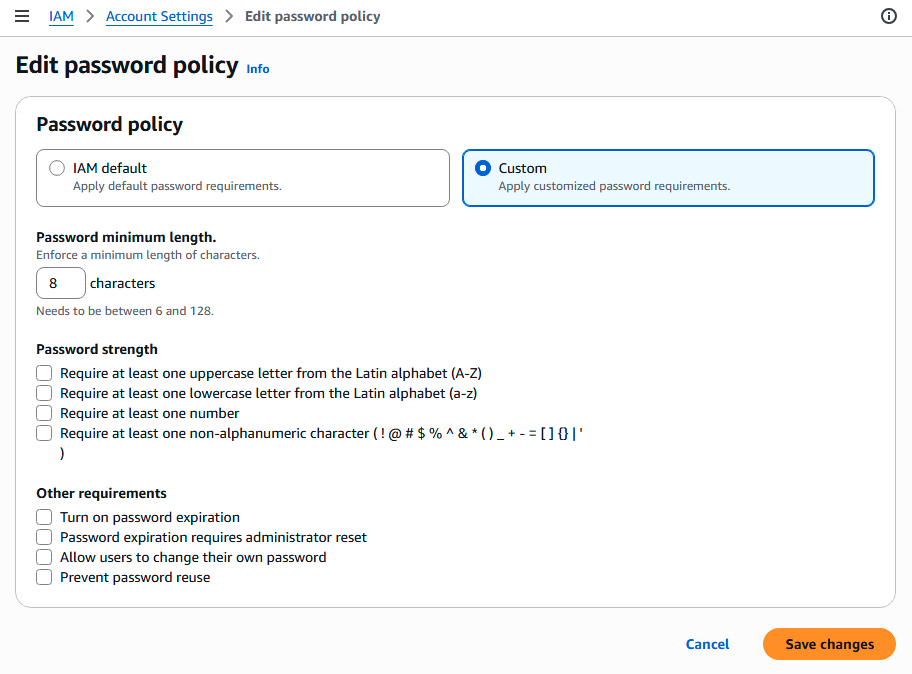

<style>
h1 {
  font-size: 28px;
}

h2 {
  font-size: 24px;
}

h3 {
  font-size: 20px;
}

h4 {
  font-size: 16px;
}

body {
  font-size: 15px;
}

highlight-orange {
  color: #FF8906;
  font-weight: bold;
}

highlight-purple {
  color: #FF00FF;
  font-weight: bold;
}

img {
  border-radius:10px;
}

figcaption {
  margin-bottom: 30px;
}
</style>

## IAM Users & Groups

- <highlight-orange>IAM = Identity and Access Management, Global service</highlight-orange>
- Root account created by default, shouldn’t be used or shared, instead create IAM users
- Users are people within your organization, and can be grouped
- Groups only contain users, not other groups
- Users don’t have to belong to a group, and user can belong to multiple groups

## IAM Permissions

- Users or Groups can be assigned JSON documents called policies
- These policies define the permissions of the users
- In AWS you apply the <highlight-orange>least privilege principle</highlight-orange>: don’t give more permissions than a user needs

## [Managed policies and inline policies](https://docs.aws.amazon.com/IAM/latest/UserGuide/access_policies_managed-vs-inline.html)

When you set the permissions for an identity in IAM, you must decide whether to use
- <highlight-orange>an AWS managed policy</highlight-orange>. Standalone policy created and administered by AWS.
- <highlight-orange>a customer managed policy</highlight-orange>. Policy you create for specific use cases, and you can change or update them as often as you like.
- <highlight-orange>an inline policy</highlight-orange>. Policy created for a single IAM identity (user, group, or role) that maintains a strict one-to-one relationship between a policy and an identity.

## IAM Polices Structure

Consists of
- **Version**: policy language version, always include “2012-10-17”
- **Id**: an identifier for the policy (optional)
- **Statement**: one or more individual statements (required)

Statements consists of
- **Sid**: an identifier for the statement (optional)
- **Effect**: whether the statement allows or denies access(Allow, Deny)
- **Principal**: account/user/role to which this policy applied to
- **Action**: list of actions this policy allows or denies
- **Resource**: list of resources to which the actions applied to
- **Condition**: conditions for when this policy is in effect(optional)

The following [example](https://docs.aws.amazon.com/IAM/latest/UserGuide/reference_policies_elements_principal.html#principal-anonymous) shows a resource-based policy that can be used instead of [AWS JSON policy elements: NotPrincipal](https://docs.aws.amazon.com/IAM/latest/UserGuide/reference_policies_elements_notprincipal.html) to explicitly deny all principals except for the ones specified in the Condition element. This policy should be added to an Amazon S3 bucket.

```json
{
  "Version": "2012-10-17",
  "Statement": [
    {
      "Sid": "UsePrincipalArnInsteadOfNotPrincipalWithDeny",
      "Effect": "Deny",
      "Action": "s3:*",
      "Principal": "*",
      "Resource": [
        "arn:aws:s3:::amzn-s3-demo-bucket/*",
        "arn:aws:s3:::amzn-s3-demo-bucket"
      ],
      "Condition": {
        "ArnNotEquals": {
          "aws:PrincipalArn": "arn:aws:iam::444455556666:user/user-name"
        }
      }
    }
  ]
}
```

## IAM Password Policy

<highlight-orange>The stronger the password you use, the higher security for your accounts</highlight-orange>.



In AWS > IAM > Account settings, you can setup a password policy either <highlight-orange>IAM default</highlight-orange> or <highlight-orange>Custom</highlight-orange>:
- Set a minimum password length
- Require specific character types: e.g. 1) including uppercase letters, 2) lowercase letters 3) numbers 4) non-alphanumeric characters
- Allow all IAM users to change their own passwords
- Require users to change their password after some time (password expiration)
- Prevent password re-use

## Multi Factor Authentication - MFA

- Users have access to your account and can possibly change configurations or delete resources in your AWS account
- You want to protect your Root Accounts and IAM users
- [MFA](https://aws.amazon.com/iam/features/mfa/) = password you know + security device you own
- Main benefit of MFA: if a password is stolen or hacked, the account is not compromised

The available MFA devices options in AWS:

- **Virtual MFA device**: Google Authenticator or Authy, phone only and support for multiple tokens on a single device. 
- **Universal 2nd Factor (U2F) Security Key**: YubiKey by Yubico (3rd party), support for multiple root and IAM users using a single security key.
- **Hardware Key Fob MFA Device**: Provided by Gemalto (3rd party).
- **Hardware Key Fob MFA Device for AWS GovCloud (US)**: Provided by SurePassID (3rd party).

## [Accessing AWS services](https://docs.aws.amazon.com/whitepapers/latest/aws-overview/accessing-aws-services.html)

To access AWS, there have three options:

::: tabs

@tab AWS Management Console

Access and manage Amazon Web Services through the [AWS Management Console](https://aws.amazon.com/console/), a simple and intuitive user interface. You can also use the [AWS Management Console Application](https://aws.amazon.com/console/mobile/) to quickly view resources on the go.

<highlight-orange>Protected by password + MFA</highlight-orange>.

@tab AWS CLI

The [AWS Command Line Interface](https://aws.amazon.com/cli/) (AWS CLI) is a unified tool to manage your AWS services. With just one tool to download and configure, you can control multiple AWS services from the command line and automate them through scripts. <highlight-orange>Protected by access keys</highlight-orange>.

[AWS CloudShell](https://aws.amazon.com/cloudshell), which can be found next to the search bar in the AWS Management Console, provides a browser-based shell that is pre-authenticated with your console credentials. Using CloudShell, you can quickly run AWS commands and scripts without leaving your web browser.

@tab AWS SDK

Our [Software Development Kits (SDKs)](https://aws.amazon.com/developer/tools/) simplify using AWS services in your applications with an Application Program Interface (API) tailored to your programming language or platform. The AWS CLI is built on the [AWS SDK for Python(Boto3)](https://aws.amazon.com/sdk-for-python/).

<highlight-orange>Protected by access keys</highlight-orange>.

:::

Access keys are generated through the AWS Console. Users are responsible for managing their own access keys and should avoid sharing them. The Access Key ID functions like a username, while the Secret Access Key functions like a password.

### AWS CLI Setup

::: tabs

@tab Windows


@tab Mac


@tab Linux