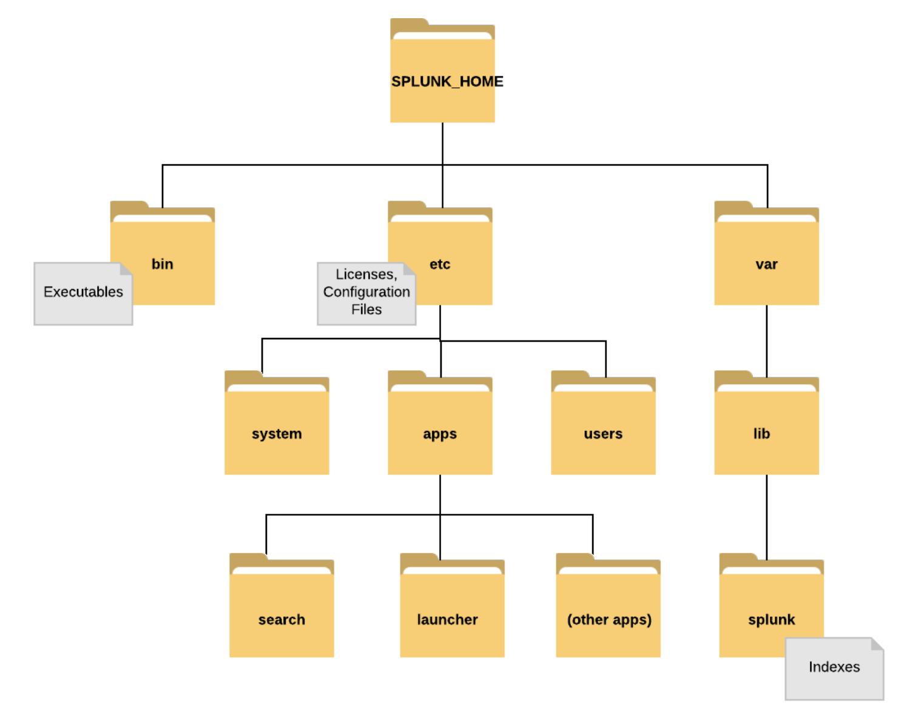
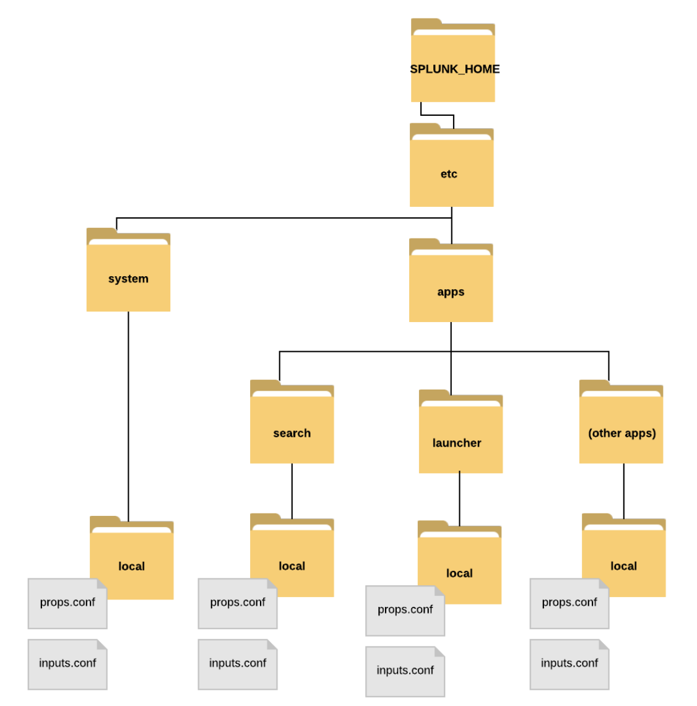
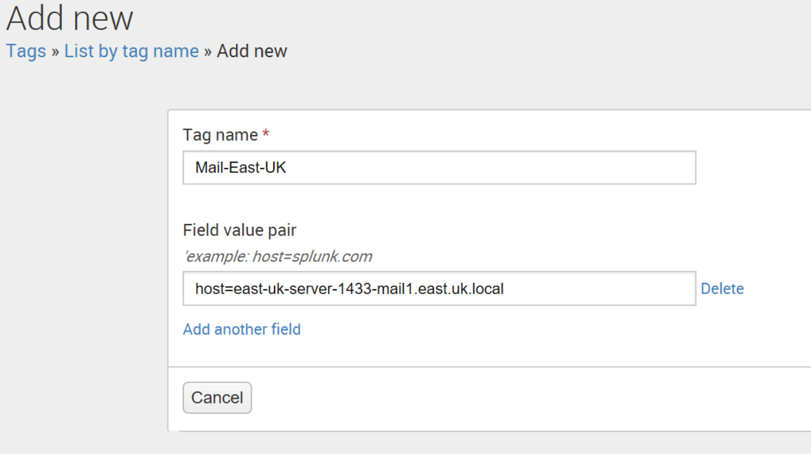
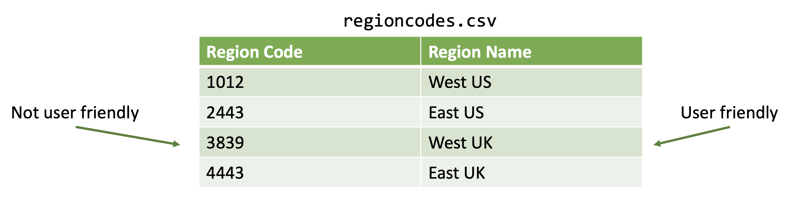

# Deployment and Forwarder Management

Deployment Server

- Allows you to manage groups of Splunk Enterprise instances from a central location.
- Identifies clients and subscribes them to **server classes**.
- A server class defines a group of Splunk deployment apps and adds them to it’s member criteria.
- Each client of a server class reconciles its apps with the server. If it is missing any, it pulls them from the deployment server.
- Deployment apps are located in `/etc/deployment-apps` on the Splunk deployment server.
- To manage deployment servers, go to *Settings -> Distributed Environment -> Forwarder Management*.


# Users, Roles, and Authentication

Settings -> Access Controls

## Splunk Users

- Can be defined locally
- Can be defined in a directory like LDAP or AD

## Splunk Roles

Users are assigned to roles, and roles take on specific capabilities. Five built in roles:

1. admin
2. power
3. user
4. can_delete(delete indexes, `index="test" | delete`)
5. splunk-system-role

## Custom Roles

- Splunk Administrators can create custom roles
- Some Splunk apps come with custom roles: winfra-admin, vmware_admin, etc. Users must be assigned to these roles to view the contents of those apps.

## Authentication Options

- Local
- LDAP / AD
- SAML
- Scripted SSO

Splunk recommends using LDAP to manage user authentication. Splunk works with OpenLDAP and Active Directory.

Create an LDAP Strategy: Settings -> Access Controls -> Authentication Method -> LDAP/LDAP settings

# [Splunk Configuration Files](https://docs.splunk.com/Documentation/Splunk/9.4.2/Admin/Aboutconfigurationfiles)

• Govern almost every aspect of how Splunk behaves.
• Are Linux-like, but can be used in Windows (suffix is .conf)
• Are multi-layered

## Splunk Installation Directory Structure



`$SPLUNK_HOME/etc/system/local` is where the main configuration files exist. Each splunk app has a set of configuration files with same file names.



## Configuration file structure

Build on *stanzas* (sections)

```conf
[stanza_header1]
attribute1 = value
attribute2 = value
[stanza_header2]
attribute1 = value
attribute2 = value
```

Example `outputs.conf` - tells an app where to send its data. We usually configure this in the Splunk GUI.

```conf
[tcpout:splunk_indexer]
Server = 192.168.1.45:9997
```

## Default Configuration Files

- Configuration files in the `/default` directories come with Splunk and have default settings, they are kind of like the example configuration files. They are meant for you to copy over into the local directory if you want to modify them.
- Default configuration files are stored in the `$SPLUNK_HOME/etc/system/default/` directory.
- Specific changes/configurations should be made in the `/local` directory. Don't change the configuration files in the default directory.
- When Splunk starts, configuration files are *merged into a single runtime model*.
    - If there are no duplicate stanzas, the resulting runtime model is the union of all files.
    - If there are conflicts(same stanza names, etc.), the setting with the highest precedence is used.

## Configuration Precedence in Splunk

1. System `/local` directory
2. App `/local` directories
3. App `/default` directories
4. System `/default` directory

Important configuration files

| File          | Purpose                                                                 |
|---------------|-------------------------------------------------------------------------|
| `inputs.conf` | Defines data inputs                                                     |
| `outputs.conf`| Defines forwarding behavior                                             |
| `props.conf`  | Indexing property configurations, custom source type rules, and more!   |
| `limits.conf` | Defines various limits for search commands                              |


# Splunk Knowledge Objects

- Knowledge Objects add knowledge to and enrich your data
- Created by a user or an app
- Include: *saved searches, field extractions, tags, event types, lookups, reports, alerts, data-models, and more*

## Saved Searches

- Can be saved as *reports, alerts, dashboard panels, or event types*
- Defined in `savedsearches.conf`

## Field Extractions

- Fields can be extracted using the field extraction editor: *Regex or Delimiter*
- Defined in `props.conf`

## Tags

Allow you to assign names to specific field and value combinations.

Example: you might have a server named *east-uk-server-1433-mail1.east.uk.local*, you know that this server is the mail server for the eastern UK region and it resides in building 1433. But Splunk and other users do not know that. So create a tag! Now users can search with this server is type `tag=Mail-East-UK`.



## Event Types

Event types like a named saved search and also like a "tag +". In other words, you can tag an entire search string with an event type before the first pipe.

Suppose you have a search that your organization runs frequently, perhaps even with small additions. Instead of typing that in every time, just create an event type, e.g. `Eventtype=EastUSErrors`. You can even include tags!

## Lookups

Lookup tables add custom fields to events from external sources, like *csv* files.



Go to *Settings -> Lookups -> Lookup table files -> Add new*

Format:

```spl
| lookup <lookup-table-name> <lookup-field1> OUTPUT <lookup-filed2>
```

Example:

```spl
| lookup regioncodes.csv RegionCode OUTPUT RegionName | table RegionCode RegionName`
```

## Data Models

Hierarchically structured data set that includes

- Events
- Searches
- Transactions

Event objects contain

- Constraints: A search string broken down into a hierarchy, host=router1, sourcetype=csv
- Attributes: Fields and properties associated with the event, evals, lookups, extracted fields

Power the Splunk Pivot tool.
