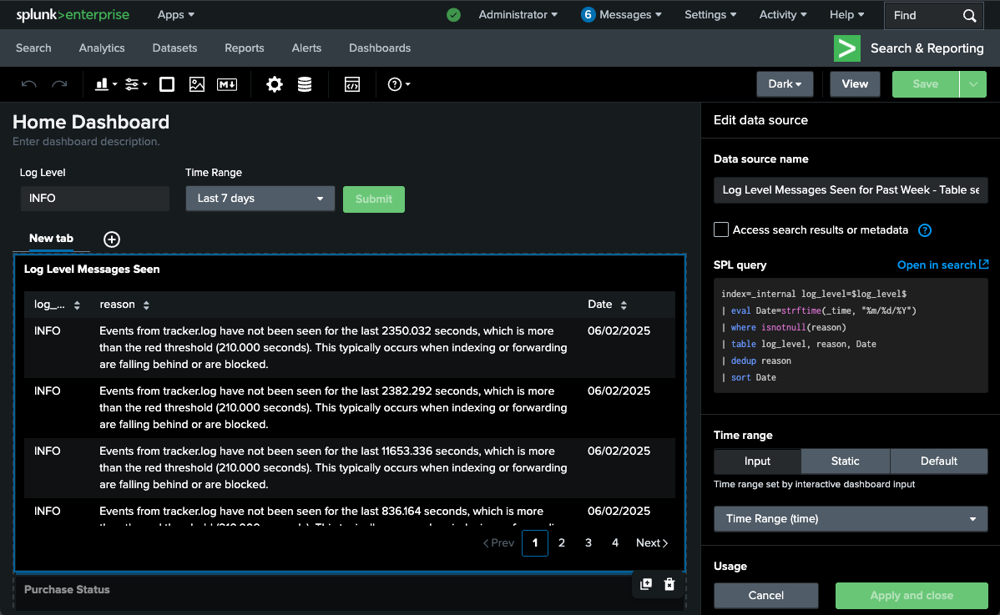
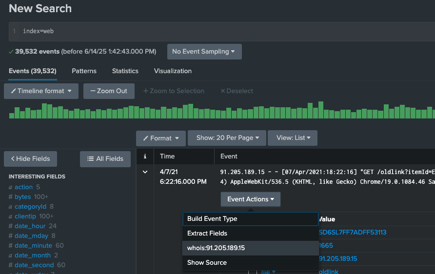

Exam preparation notes for the <span style="color: #12db8e;">**Splunk Core Certified Power User**</span>.

## Transforming Commands

If you are doing search in smart mode, the mode that will toggle the search behavior based on if the search contains a transforming command. If it does, then it's going to act like fast mode, 

- top: `index=web | top file`, `index=security "fail*" | top src showperc=f`
- rare: `index=web |rare categoryId`
- stats:

    ```spl
    index=web | stats sum(bytes)
    index=web | stats count by categoryId
    index=web | stats dc(categoryId)
    # or
    index=web categoryId=* | dedup categoryId
    # or
    index=web categoryId=* | dedup categoryId | stats list(categoryId)
    # or
    index=web | stats values(categoryId)

    index=web | stats count by referer_domain, action
    index=web | stats count by referer_domain, action | stats sum(count) by referer_domain
    index=security | stats count by src, user, action
    index=security | stats values(user) as "Login Name", count(user) as "Attempts" by src | fillnull value="N/A"
    index=web OR index=security | stats sum(bytes) as Total_Bytes | eval Total_Bytes=tostring(Total_Bytes, "commas")
    ```

More useful commands:

```spl
index=web | table clientip, action, categoryId, status | where isnotnull(action)
index=web | table clientip, action, categoryId, status | where isnotnull(action) | rename action as "ACTION", clientip as "Shoppers IP" | fields - status
index=security user=admin vendor_action=Failed host=web1 src_ip="87.194.216.51" earliest=0 latest=now
```

## Transaction Commands

- `maxspan`: Max time between all related events, e.g. `maxspan=15m`.

- `maxpause`: Max time between each individual event, e.g. `maxpause=1m`.

- `startswith` & `endswith`: Set your variables for keywords.


### Investigate the events

- Events that span time: Can come from multiple hosts, relate to one host of interest.
- Grouping of events: Show the entire conversation, from start to finish in one view.
- Aid investigations: Relate user activity for logins, session lengths, browsing history, etc.
- Log validation: Check to see if data is related to network logs of interest, website traffic, emails, etc.

### Transaction vs. stats

| Transaction                                                 | Stats                                              |
|-------------------------------------------------------------|----------------------------------------------------|
| Slow abd will tax your environment                          | Faster, more efficient searching                   |
| Granular analysis(logs, user behavior, conversations, etc,) | Looking at larger pool of events for trend analysis(no limit on number of events returned) |
| Small scope on one item of interest                         | Broad searching and grouping of events             |
| Correlations need to be found from start to end             | Mathematical functions needed                      |

### Demo

```spl
index=web 
| search status=404
| transaction JSESSIONID maxspan=10m maxpause=3s
```

```spl
index=security failed
| transaction src maxspan=3m maxpause=3s 
| eval duration=tostring(duration, "duration") # evaluate a new field
| table src, duration
```

```spl
index=web
| transaction clientip maxspan=10m maxpause=3s endswith=purchase
| eval duration=tostring(duration, "duration") 
| table clientip, duration, action
```

## Manipulating Your Data

### eval

- Calculates fields: Does the math you ask: +, -, *, /, AND, XOR, >=, ==
- Functions friendly: Just like stats, it takes plenty of functional arguments: `if, null, true, cidrmatch, like, lookup, tostring, md5, now, strftime`
- Create new fields: Eval will take the results of the SPL into a field that is existing, or create a new one
- Coverting data: Tell Splunk to display a field value of bytes to megabytes by providing the math in an eval statement: `strftime, strptime`.

### where & search

| where                                                 | search                                 |
|-------------------------------------------------------|----------------------------------------|
| Can not place before first | in the SPL               | Place it anywhere in the SPL           |
| Comparing values, or searching for a matching value   | Search on a keyword, or matching value |
| Use with functions                                    | Search with wildcards                  |
| *think boolean operators=where                        | *think expressional searches=search    |

### Demo

```spl
index=_internal 
| eval epoch_time=strptime(_time, "%s")
| eval human_readable_time=strftime(epoch_time, "%m/%d/%y") 
| table _time, epoch_time, human_readable_time
```

```spl
index=_internal 
| eval DayOfTheYear=strftime(_time, "%j") 
| search DayOfTheYear=141
```

```spl
index=web
| eval status_codes=case((status==404), "Not Found", (status==400), "Bad Request Response", (status==200), "Success")
| stats count by status, status_codes
```

```spl
index=web
| stats count(eval(status==404)) as "Number of not founds"
```

```spl
index=web
| eval hash=md5(file)
| table file, hash
| dedup file
```

```spl
index=security
| table src, user, action
| where like(src, "50.%") AND user="mail" # boolean logic
```

```spl
index=security
| table src, user, action
| where like(src, "50.%")
| search user=mail
```

## Field Extractions

- Regex: Unstructured data
- Delimiters: Structured data
- Commands: Work with `rex` and `erex` in your SPL.

`rex` uses a regex to create a new field out of a filed that already exists.

`erex` helps to generate the regex as long as you provide example of what you want to extract.

3 ways to navigate to Field Extractor:

- Settings > Fields > Fields Extractions > Open Field Extractor
- From the "Event Actions" dropdown menu
- The bottom of the left panel, under the "INTERESTING FIELDS"

### Demo

[Regular Expressions 101](https://regex101.com)

```spl
index=cisco 
| rex field=_raw (?<email>"\S+@\S+\.com")
```

```spl
index=cisco 
| erex files examples="text/css", "image/gif"
| stats values(files), values(http_content_type)
```

## Lookups

What's a lookup?

- A file. Mostly static data that is not in an index. e.g. csv of all employees.
- A tool. Add additional fields to search for. Fields will be added to the fields bar menu.

How to use?

- Data enrichment. Add information and store it in a table/file format to then search.
- Commands: lookup, inputlookup, outputlookup, OUTPUT, OUTPUTNEW.
- Create or Upload. Select a file to upload or make one to reference. Lookups can be configured to run automatically.

### Demo1
1. Create a "Lookup table files"

    ```spl
    | inputlookup peopleinfo.csv where (state="New York")
    ```

2. Create a "Lookup definitions" using the created lookup table `peopleinfo.csv`(file-based).

3. Update permissions.

### Demo2

1. Export the product ids as csv.

    ```spl
    index=web | table productId | dedup productId
    ```

    Then and additional information in the exported csv.

2. Create a "Lookup table files" using the updated csv.

3. Update permissions.

4. Search

    ```spl
    index=web action=purchase
    | lookup productinfo.csv productId OUTPUT description
    | table productId descrition
    | where isnotnull(productId)
    ```

    ```spl
    index=web action=purchase
    | lookup productinfo.csv productId OUTPUT description
    | stats count by productId description
    | where isnotnull(productId)
    | sort - count
    ```


## Visualization

### Commands

- timechart: time series will display statistical trends over time, single or multi-series, `span=1d`
- chart: line, area, bar, bubble, pie, scatter, etc, stacking available, remove empty values `useother=f usenull=f`
- stats: can easily alter any stats table
- iplocation: add location info to your visualizations
- geostats: calculate functions to display on a cluster map. `latfield, longfield, globallimit, locallimit`
- addtotals: add multiple values together on a chart, compute total sums of values. `fieldname, label, labelfield`
- trendline: overlay on a chart to show the moving average. `sma, ema, wma`

### Options to set in visualization

- stacking: On=events are vertically stacked(top to bottom), Off=counts are horizontally stacked(left to right)
- overlay: add two line charts over each other
- trellis: display multiple charts at once
- multi-series: On=y-axis to split for each value, Off=all fields share the y-axis

### Demo

Timechart:

```spl
index=web | timechart avg(bytes) by host
```

Chart: doesn't give you data over time.

```spl
index=web | chart avg(bytes) by host
```

Timechart with where:

```spl
index=web | where isnotnull(action) | timechart count by action
```

`useother=f` means takes the OTHER value off the chart. It displays the top 10 values by default, `limit=0` means no limitation to return all values.

```spl
index=web action=purchase
| lookup productinfo.csv productId OUTPUT description
| where isnotnull(productId)
| chart count over host by description useother=f limit=0
```

Line chart

```spl
index=security Failed
| timechart count by user useother=f usenull=f limit=5
```

Area chart. `Add 5-period simple moving average trendline for smoothing`

```spl
index=_internal sourcetype=splunkd
| timechart count
| trendline sma5(count) as "Moving Average of Total Events"
```

It creates a new column "City" which based on the latitude and longitude information associated with the `ip_address`.

```spl
| inputlookup peopleinfo.csv
| iplocation ip_address
```

`iplocation` command can generate the latitude and longitude fields if they don't exists.

```spl
index=web | iplocation clientip
```

Cluster map

```spl
| inputlookup peopleinfo.csv
| geostats latfield=lat longfield=long globallimit=10 count by email
```

```spl
index=web action=purchase
| iplocation clientip
| geostats count by action
| where purchase>500
```

`addtotals` or change the options in the statistics format(Format -> Summary -> Totals/Percentages).

```spl
index=web action=purchase
| iplocation clientip
| geostats count by action
| addtotals row=f col=t label="Total Purchases" labelfield=longitude purchase
```

## Reports & Drilldowns

### What are reports?

- A saved search: anything that is a search can be saved as a report.
- Live results: re-run a report, or set it to run on a schedule.
- Sharable Knowledge Object: let anyone view your reports, or add them to a dashboard for people to reference.
- Splunk knowledge object naming convention best practice: `{group_name}_{object}_{description}`

### Drilldown Functionality(Interactions)

- Actions: link to search, link to dashboard, link to report
- $token$: tokens play a key role in passing variables from panel to panel
- Export: export as a PDF, print, or include in a report

### Home Dashboard

Navigate to Settings > Dashboards > Edit > Set as Home Dashboard

### Demo

```spl
index=_internal log_level=*
| eval Date=strftime(_time, "%m/%d/%Y")
| where isnotnull(reason)
| table log_level, reason, Date
| dedup reason
| sort Date
```

Save as a dashboard panel and *add input(Text)* in it, then update the spl(panel data source) using *token name - log_level* :

```spl
index=_internal log_level=$log_level$
| eval Date=strftime(_time, "%m/%d/%Y")
| where isnotnull(reason)
| table log_level, reason, Date
| dedup reason
| sort Date
```

We can also add an input "Time range", then update the "Time range" of the data source as `Time Range(time)`.



Save below search as report(schedule report) and put it into the dashboard:

```spl
index=web action=purchase categoryId=TEE 
| table action, uri, status
```

Then we can add a *interaction* "Link to search" for this report. Now the field values are clickable and hyperlinked.

Or we can *Add interactions* "Set tokens"(Use predefined token, token name: userclick_field, token value: name, token name: userclick_value, token value: value), then add a new event(chart/panel) and set its data source `index=* $userclick_field$=$userclick_value$`.


## Alerts


### What are Alerts?

- Saved searches: run on schedule, run real-time
- Content matches: fire when a condition is matched
- Create trigger actions: log, send mail, webhook, custom action
- Create trigger conditions: per-result, # of results, # of sources, custom, throttle

## Tags and events

More information about tags and events can be found [here](./Splunk-Advanced-Concepts.md#tags).

### What's a tag?

- Quick reminder: what was I trying to see again
- Aid for reading data: create as many tags as you want
- Case sensitive: typing matters when searching

### What are event types?

- Highlighter: make them colors, mark events with similar criteria
- Like a report, but not: save searches as specific event types, sort into categories, no time range. For example, `status=404` can be saved as "Not Found"
- More specific: set strings, field values, and tags

### Demo

1. Create a tag for a selected field in an event.
2. Search it `index=web tag=login`

## Macros

Navigate to Settings -> Advanced search -> Search macros

- Shortcuts: fast, saved off searches to run by name
- Repeatable: the macro never changes, unless you edit it
- Expandable: ctrl+shift+e for windows, command+shift+e for macos
- `macroname`: run with the use of backticks, not single quotes

### Demo 1

Create a new search macro with a "Name" and "Definition", use below spl as macro definition.

```spl
index=web action=purchase
| stats count by host
| addtotals col=t row=f fieldname="Total" labelfield=host count
```

Then type `macroexample` in the search bar. This will run the macro which is equivalent to the spl above.

### Demo 2

Create a new search macro `loglevel(1)` with below spl and a argument `input`.

> If use arguments, you have to specify in the macro name how many arguments used.

```spl
index=_internal log_level=$input$
| table host, log_level event_message, _time
```

To run a macro with an argument, you need to specify what you're putting in. For example, `loglevel(ERROR)` or `loglevel(*)`.

## Workflows

Navigate to Settings -> Fields -> Workflow Actions

- Assess Actions: Depending on use case, there are three available workflow actions which provide different functionalities
- Create Workflow Action: Using Splunk Web, create a new Workflow Action to either push, pull or search data
- Configure Workflow Action: Within the Web GUI, configure the previously determined action type with a 3rd party source
- Validation: Check to see if data is being pushed, pulled or searched for after configuration

### Workflow Actions

- GET: Create HTML links to interact with sites. Ex: Google searches, querying WHOIS databases
- POST: Generate HTTP POST request to specified URI. Ex: Create entries in management systems, forums
- Search: Launch secondary searches using field values. Ex: Occurrences of IP addresses over events

### Demo

Create a new workflow actions with below configurations(default values for all other fields):
- Name: IP whois lookup
- Label: whois:$clientip$
- Apply only to the following fields: clientip
- URI: https://whois.domaintools.com/$clientip$

Change the permissions of this workflow action to "All apps(system)" with admin write and everyone read.

Now go to searching & reporting and type `index=web` in the search bar, expand a event and click menu "Event Actions" -> "whois:$clientip$".



## Data Normalization & Troubleshooting

> Navigate to Settings -> Fields -> Field Aliases / Calculated Fields

Field aliases: Normalize your data by creating a new field with a different name. Apply multiple fields to the same field alias. Make searching easier amongst users.

Calculated fields: Like a macro, but for fields. Save off quick math to output fields using the eval command, then use it in a search.

### Buckets

Hot/warm/cold buckets are searchable. Warm and cold buckets cannot be written to.

- hot bucket: Data is being actively written to the bucket by an indexer. **Only writable bucket**.
- warm bucket: Data is getting older, rolled from hot to warm.
- cold bucket: Data is even older.
- frozen bucket: Data is going to get archived or deleted after being frozen based on the data retention policy. Data is not searchable.
- thawed bucket: Moved from frozen bucket, and the data is searchable again.

### Job inspector

- tool: allows you to troubleshoot your search efficiency, or reason for failing
- informative: gives you information about how the search completed, and time it took to run
- tips: if you are using a knowledge object wrong, it will suggest how to correct your search

### Demo

#### Field Aliases
1. Figure out the source types for the indexes by using `index=web OR index=security OR index=cisco | stats values(sourcetype)`.
2. Create three field aliases with below configurations, so that all the indexes can be searched by the same field name `source_ip`:
    - Name: *source_ip*
    - Apply to *sourcetype* named *{sourcetype}* (sourcetype can be *linux_secure*, *access_combined* and *cisco:wsa:squid*)
    - Field aliases: *clientip=source_ip* (or *src=source_ip*, clientip and src are the fields that have values of ip addresses)
3. Then run the search `index=web OR index=security OR index=cisco source_ip=*` to get all the events with ip addresses from the three indexes.

#### Calculated Fields
1. Create a new calculated field with below configurations:
    - Apply to *sourcetype* named *access_combined*
    - Name: *megs*
    - Eval expression: *bytes/1024/1024*
2. Then run the search `index=web | stats sum(megs) as megs by file | sort - megs` to get the converted bytes to megs.

#### Troubleshooting your SPL
1. Job inspector
2. Administrator -> Preferences -> SPL Editor -> Search assistant -> Full

#### Buckets

Returns information about the buckets in the Splunk Enterprise index.

```spl
| dbinspect index=*
| fields bucketId, state, index, modTime
```

## Data Models

### What are datamodels?

- Hierarchical: parent and child relationship. Root dataset.
- Dataset searching: select the specific datamodel and dataset you want to search.
- Normalization tool: CIM(The Common Information Model) compliance, data mapping to a model that fits that type of data.
- Large data searches: search larger amounts of data faster, with tstats and accelerated datamodels.

More information about datamodels can be found [here](./Splunk-Visualizing.md#data-model).

### Commands and use cases

Get the count of events from the Web datamodel.

```spl
| tstats count from datamodel=Web
```

Get the count of events from the Web datamodel by sourcetype.

```spl
| datamodel Web search
| search sourcetype=*
| stats count by sourcetype
```

Search the root dataset *Audit* of the *internal_audit_logs* datamodel.

```spl
| datamodel internal_audit_logs Audit search
| search *
```

## The Common Information Model

### What is CIM

[Common Information Model Add-on Manual](https://docs.splunk.com/Documentation/CIM/6.1.0/User/Overview)

- A Model: a model to use and reference a common standard of operations for how all data is handled.
- An Application: CIM Add-On and the CIM Add-On Builder are available for free.
- Data Normalizer: in the end, all fields can have the same name. All apps can co-exist together.

### How to leverage its features

- Normarlize Data: the CIM gives Splunkers a way to normalize data.
- Assistance: leverage it when creating field extractions, aliases, tags, etc.
- Datamodel command: be able to run common searches that span larger amount of data.

### Why it is important

- Splunk Premium Apps: Splunk Enterprise Security relies heavily on CIM compliance data.
- Health Check Tool: Perform faster, more efficient searches that leverage searching data models instead of raw events.
- Ease of Use: Find commonality between Splunkers.
- Audit: Check to see if all of our data going into Splunk is CIM compliant.

Two CIM add-ons are available for free:
- The standard CIM Add-On
- The tool of the CIM Add-On Builder

### Demo - CIM Add-On

1. Navigate to *Apps -> Find More Apps -> Search "CIM"*
2. Install add-on "**Splunk Common Information Model (CIM)**" and restart the Splunk server.
3. Go to *Settings -> Data Models*, you can see there have been added some data models which come with the CIM add-on.
4. Create a new event type with following configurations:
    - Name: *web1*
    - Search string: `index=web host=web1`
    - Tags: *web* (The Web data model needs the **field** *tag* to be *web*)
    - Color: *magenta*
    - Priority: *1 (Highest)*
5. Edit the permissions of the event type to "All apps(system)" with admin write and everyone read.
6. Now go to the *Settings -> Data models -> Web -> Pivot -> Web*, there should have count of events larger than 0.
7. Or run the search `| tstats count from datamodel=Web` to get the count of events from the *Web* data model.

### Demo - CIM Add-On Builder

1. Navigate to *Apps -> Find More Apps -> Search "Splunk Add-on Builder"*
2. Install add-on "**Splunk Add-on Builder**" and restart the Splunk server.
3. Create a new add-on with a name "**My Custom CIM**" and leave the other fields as default.
4. Go to *Manage Source Types* tab and click on the *Add* button to select *Import From Splunk* from the dropdown menu.
5. Then *Select a Source Type*: *access_combined** and save.
6. Move to the tab *Map to Data Models* and click on the button *New Data Model Mapping* with below configurations:
    - Enter a name for the event type: *web2*
    - Select one or more source types: *access_combined*
    - Enter a search: `(index=web sourcetype=access_combined)`
7. Click on the *Save* button to save the mapping.
8. In the *Data Model Mapping Details* page, click on the button *Select Data Model(s)* on the right side of the page.
9. Select the *Web* data model and click on the *Select* button.
10. Click on the *New Knowledge Object* button and select *FIELDALIAS* from the dropdown menu.
11. Select a field *clientip* on the left side to map to the field *src* on the right side.
12. When finished mapping all fields, click on the *Done* button.
13. Move to the tab *Validate & Package*, this is where you can validate and download the TA(technology add-on) package.
14. Now run the search `| tstats count from datamodel=Web` to get the count of events from the *Web* data model. The result proves that all the events are mapped to the *Web* data model.
15. Go to *Settings -> All configrations*, this is where you can see the TA that you just built.
