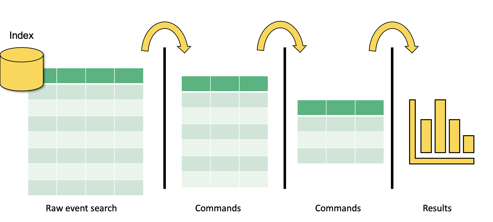

# What is Search Processing Language (SPL)?

SPL encompasses all the search commands and their functions, arguments, and clauses. Its syntax was originally based on the Unix pipeline and SQL. The scope of SPL includes data searching, filtering, modification, manipulation, insertion, and deletion. - The Splexicon

One of the most important activities we do in Splunk is search. But Searching in Splunk is not just Googling data — it's a powerful way to interact with the data.

## What Does it Mean to Search in Splunk?

It's the primary way users interact with data in Splunk. 
- Query
- Calculate
- Correlate
- Manipulate
- Organize
- Predict
- Transform
- Visualize
- And more ...

## Search and Reporting App

- Default app, comes built-in to Splunk Enterprise or Cloud platform.
- Primary way to search and analyze data in Splunk
    - Search
    - Build reports and visualizations
    - Index data
    - Configure alerts
    - Create dashboards

# The Anatomy of a Search

A Splunk search is all about reducing complexity in unstructured or semi structured data so that it provides value to data analysts and users. A basic search pipeline looks like this:

Step 1: We input a big glob of events. This data can come from forwarders, network inputs, scripted inputs, uploads, anywhere. Then we perform broad searches on it so that we filter out some of the data that we don’t want.

In step two, we have a slightly better data set to work with. Now, we can perform further searches, commands, and transformations until we get the data we want into the format we want.

In step 3, we have the data we want in the format we want, and now we have to decide what to do with it. In this step, we create reports, dashboards, and alerts.

And in between each step is the Unix pipe `|`.

The pipe opeators tell Splunk to take the output of the previous commands, do something with it, then output it to the next step.

We continue to do this until we have the data we want in the format we want.

# Time

How Splunk handles time is important. Data analytics rely on timestamps in the data. It doesn't make sense to know, for example, how many failed login attempts there were if we don't have a time window in which we are interested.

## Timestamps

- Timestamps are converted to UNIX time and stored in the `_time` field
- Splunk converts the time into human readable format
- Splunk assumes that any data indexed is in the time zone of the Splunk instance

UNIX time is the number of seconds that have elapsed since January 1, 1970, also known as epoch time.

## The _time Field

- A default, and essential, field
- Values in the `_time` field are stored in UNIX time
- In Splunk web, the `_time` field appears in human-readable format
- Use search commands to manipulate the time format

We can format time in any way we want using Python stripf and stringf time and stringp time (we'll talk about these later).

## Splunk process for determining and assigning the timestamps

Splunk is good at dealing with unstructured data. Unstructured data often has timestamps that are not in traditional formats, or sometimes none at all.

How Splunk determines timestamps

1. Looks for the timestamp in the event data

- It looks for a time or date in the event 
- If an event has a time and date, but not a year, Splunk software determines the year, as described in the link below - "How Splunk software determines timestamps with no year", and builds the timestamp from that.

2. Looks at the source name or file name
- If no events in a source have a date, Splunk software tries to find a date in the source name or file name

3. For file sources: File modification time
- For file sources, if no date can be identified in the file name, Splunk software uses the file modification time.

4. Last resort
- As a last resort, Splunk software sets the timestamp to the current system time when indexing each event.

[How timestamp assignment works](https://docs.splunk.com/Documentation/Splunk/8.0.0/Data/HowSplunkextractstimestamps)

## The Time Range Picker

- Splunk uses time stamps for the time range picker
- The defaults for the time range picker are Real-Time, Relative, and Other
- We can also do some more granular things with time selection

## Specify Absolute Time Ranges Using SPL

- Specify time ranges directly in your search
- For absolute ranges: 

  `earliest=<%m/%d/%Y:%H:%M:%S> latest=<%m/%d/%Y:%H:%M:%S>`
 
  For example, `earliest=01/01/2025:17:30:00 latest=07/14/2021:21:00:00`

- For relative ranges:
  - `+` or `-` to indicate the offset
  - Number
  - Time unit (years `y`, quarters `q`, months `mon`, weeks `w`, days `d`, hours `h`, minutes `m`, seconds `s`)
  - For example, `-30m` means 30 minutes ago, `-7d` means 7 days ago, `+1d` 1day from now

# Time Variables

- Format **time** using time variables
- Useful when evaluating time and specifying time in SPL

  | Variable | Description                                |
  |----------|--------------------------------------------|
  | `%c`     | Date and time in the format of the server  |
  | `%H`     | Hour (24-hour clock)                       |
  | `%I`     | Hour (12-hour clock)                       |
  | `%M`     | Minutes (00 - 59)                          |
  | `%p`     | AM or PM                                   |
  | `%S`     | Seconds (00 - 59)                          |

- Format **dates** using variables

  | Variable | Description                                 |
  |----------|---------------------------------------------|
  | `%F`     | Date in ISO 8601 format (yyyy-mm-dd)        |
  | `%A`     | Full weekday name (Monday)                  |
  | `%d`     | Day of month (01 - 31)                      |
  | `%j`     | Day of year                                 |
  | `%B`     | Full month name (January)                   |
  | `%m`     | Month (01 - 12)                             |
  | `%y`     | Year as a two-digit number (00 - 99)        |
  | `%Y`     | Year as a four-digit number (yyyy)          |

## Converting Time Using `strftime`

We can convert time into the format we want during search time using an `eval` expression, `strftime`, and time variables on the `_time` field

`| eval <new field> = strftime(<time field>, "<format>")`

For example, `| eval New_Time = strftime(_time, "%I:%M, %p")`

| _time     |    | New_Time  |
|-----------|----|-----------|
| 160617990 | -> | 1:05, PM  |

It is currently Monday, January 1st, 1900 at 5:00 PM. How will the following string format this time and date?

| String                     | Answer                               |
|----------------------------|--------------------------------------|
| `%A, %B %d, %Y - %l:%M %p` | `Monday, January 01, 1900 - 5:00 PM` |

# Basic Searching

1. Broad search terms - metadata

- Index: `index = main`, `index = default`
- Host: `host = server.com`, `host = 192.168.1.1`
- Source, sourcetype: `source = /var/lib`, `sourcetype = csv`

2. Broad search terms

- Keywords: failed, error
- Phrases: "failed login"
- Fields: Key value pairs, e.g. user=user1.domain.com
- Wildcards: *ailed, fail*, user=*
- Booleans: AND, OR, NOT (In most cases, a space indicates a `AND`)

3. Basic search commands

- `chart` / `timechart`: returns results in tabular output for charting
- `rename`: renames a specific field
- `sort`: sorts results by specified fields
- `stats`: statistics
- `eval`: calculates an expression
- `dedup`: removes duplicates
- `table`: builds a table with specified fields

## Constructing a basic search

`Search Terms` | `Commands`

`host=myhost.lcl  source=hstlogs  user=* (message=fail* OR message=lock*) | table _time user message | sort -_time`

To construct a basic search, we begin with broad search terms. If we know any of the metadata, it is wise to start filtering based on that. For example, in this search, we have specified the host and the source. That takes a potentially huge burden off of the system because now there is a bunch of data that Splunk doesn’t need to worry about.

We are also specifying a specific field, user, and an asterisk. That means that we want Splunk to search the user field for any value (we assume this contains usernames). 

Next, we are specifying two additional fields using a Boolean `OR`. This is saying ”search the message field for anything that starts with “fail” (so that could be fail, failure, failed, etc.) OR anything in the message field that starts with lock (so it could be locked, locking, etc.).

After our broad search is complete, it’s time to do some commands to manipulate the results to get them into the format we want. In this search, I began with the pipe delimiter. You can put the pipe delimiters on separate lines for a nice, clean look. They can all go on the same line as well.

I’ve done two commands here. The first one is to build a basic table with three fields. The `_time` field is a Splunk default metadata field that is a timestamp (more on that next), the next field is user - we searched the user field and so this will display all data with that field and any value. The next field is the message field, and it will display message fields with fail* OR lock* and nothing else.

Then we do another command that sorts descending by the `_time` field.

# Fields

Fields are searchable key-value pairs. When Splunk processes event data, it looks for potential fields in the data.

- Searchable key - value pairs
- key = value

## Field Discovery

Splunk has a powerful field discovery engine. Here’s how it works:

1. First, it discovers default fields in the data. Default fields include `host`, `source`, `sourcetype`, `_time`, and more.
2. Next, it looks for obvious key-value pairs in the first 100 events in the data. 
3. Then, it builds fields using custom field extractions built by users and apps, the field extractions are stored in configuration files.

Splunk automatically discovers fields
- Default fields: host, source, sourcetype, _time, etc.
- Obvious key-value pairs
- Field extractions

Splunk has three search modes. Selection of these search modes have a significant impact on the performance of your Splunk environment. There are use-cases for each mode.

The default mode is **Smart mode**, in which, as we’ve discussed, Splunk attempts to determine what results you are looking for and return them as quickly as possible, based on the structure of your search. By default, Smart mode attempts to discover fields in the data by looking for key=value pairs. If your search contains transforming commands, like stats chart and timechart, then Smart mode acts more like fast mode assuming you don’t need any more automatic field discovery.

**Fast mode** is great when you know all of the fields you want to search, and you specify them in the search. Your search can run super fast because Splunk doesn’t have to use processing power to discover fields. Fast mode disables field discovery.

**Verbose mode** should be used when you don’t know much about the data and need Splunk to expend its full resources auto discovering fields. Verbose mode returns all event and field data it can possibly find, at the cost of a slower search.

## Field Extractions

- Custom field extractions can be built using the Splunk field extractor
- Uses regular expressions (regex) to extract fields based on patterns
- You can also do your own manual field extractions by writing regular expressions in configuration files

# Demo - Searching and Reporting

- Data Summary
- Create Table View and Pivots
- Basic Searching and Creating a Dashboard. Save As Dashboard Panel.
    - Visualization / Line Chart: `host=splunkmain backupduration=* domain=* | table _time backupduration`
    - Statistics: `host=splunkmain backupduration=* domain=* | table _time backupduration domain | head 5`
    - Visualization / Single Value / Format: `host=splunkmain backupduration=* domain=* | stats avg(backupduration)`
    - Visualization / Single Value / Format: `host=splunkmain backupduration=* domain=* | stats max(backupduration) by domain`
- Time Format: `host=splunkmain | eval new_time=strftime(_time, "%m-%d-%y %I:%M%p") | table _time new_time`
- Field Extractions: `index=_internal` -> Extract New Fields -> Source Type / Select Sample Event -> Select Method
    - Regular Expression -> Select Fields -> Validate -> Save -> `index=_* OR index=* sourcetype=splunk_web_access | table _time protocol`
    - Delimiters -> Rename Fields -> Save -> `index=_* OR index=* sourcetype=splunk_web_access | table _time protocol ip`

## Intermediate Searching

The most popular transforming commands:

## top

- `top <field>`
- returns the most common values of a given field
- defaults to 10 fields
- can be combined with `limit=<number>`
- automatically builds a table with `count` and `percent` columns
- can be used with multiple fields, return the top value for a field organized by another field
- Examples: `host=splunkmain state=* level=critical | top state by level`

## rare

- `rare <field>`
- Opposite of top
- Returns the least common values of a field
- Options are identical to top
- Examples: `host=splunkmain state=* level=critical | rare state by level`

## stats

- `stats <function(field)> BY <field(s)>`
- Some common functions: `count`, `avg`, `max`, `mean`, `median`, `sum`, `stdev`, `values`, `list`
- Examples: `| stats avg(kbps) BY host`, `host=splunkmain state=* user=* | stats count(user) AS user_count BY state | sort -user_count`

# Keyboard Shortcuts

| Action | Windows | MacOS |
|--------|---------|-------|
| Format a search | `Control + \` | `Command + \` |
| Expand a search | `Control + Shift + E` | `Command + Shift + E` |
