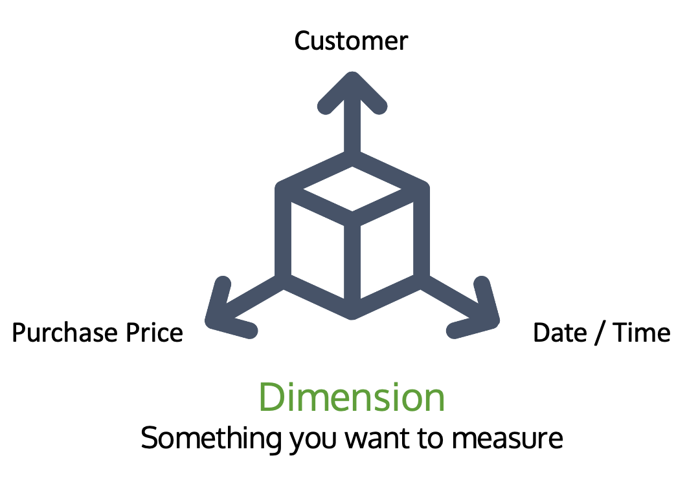

# The Basics of Visualization

> We have to know our audience and the story we are trying to tell.

Why Visualize Data?

- Data alone is not very interesting to look at
- Non-technical people might not be interested in tabular data
- Visualizing data is more human centric
    - Humans are pattern recognizing machines
    - From an early age, we are taught to visualize data
    - Visualizations are art, and therefore have an emotional impact on us

## Dimensions

A dimension is something we want to measure by. Think of a dimension as one side of a cube - that's why we call cubes “three dimensions”

What are the dimensions of a cube? Height, width, and depth.

What if we want to measure something else, say date/time, customer, and purchase price?

Now, when we get a bunch of dates/times, a bunch of customers, and a bunch of purchase prices, we have a cube made up of smaller cubes.

Each small cube is one date/time, one customer, and one purchase price. This is called the grain. The grain is the lowest level of detail that satisfies the business requirement and that is in our data set.

# Dataset

In Splunk, a dataset is a collection of data that (usually) knowledge managers define and maintain for a specific business purpose. A data set is full of dimensions by which you measure the data.

# Data Model

In Splunk, a data model is a collection of data sets. The Pivot tool is powered by data models. Knowledge managers create data models so that data analysts can easily consume the data and use the Pivot tool to create reports and visualizations. This allows data analysts and business users to create powerful visualizations without needing to know SPL or the inner workings of Splunk.

- Make machine data easier to use
- Simplify complex data through abstraction
- Group specific types of data
- Mathematical equations can be said to be data models
- Data Models are Stacks of datasets
- Datasets are stacks of knowledge objects
- Knowledge objects include: Saved searches, field extractions, tags, and more

Data models are hierarchical. They start with either a root event(far more popular) or root search. You can also have a root transaction, but one of the other two roots have to exist first. These roots have constraints. At the root level, constraints should be broad. In fact, roots are required to have and index-level constraint.

- **Events** - Most commonly used. *Event constraints* - Must include an index constraint (`index=`)
- **Searches** - Spunk saved searches that include transforming commands, etc. *Search constraints* - Constrained to the full search string (Must include an index constraint (`index=`))
- **Transactions** - Combine multiple events from one or many sources into a single event. *Transaction constraints* - must be legally formed transaction search

Fields and Data Models:

- Can be added to roots and children
- Children inherit all fields from their parent
    - Auto extracted - Splunk automatically discovered fields
    - Eval - A field generated as a result of an eval expression
    - Lookup - Fields that are the result of a lookup
    - Regular expression - Fields extracted by regex

# Data Visualization Context

- Understand your audience
    - Executives usually have different needs than individual contributors
    - Publicly available dashboards might display different data than internal-only reports and dashboards

- Understand your own goals
    - What is the message for which you are using this visualization?
    - Like the famous "author's purpose" consider the PIE: do you want to persuade, inform, or entertain or a combination of all 3?

# Types of Visualizations in Splunk

Here are just a few of Splunk's chart types. These are the ones I see most often.

- PIE - shows a single dimension with the slices representing frequency or density of values in a field. 
- Line - Show how a value changes over time
- Area - Show changes in an aggregated over time
- Column/Bar - Show discrete values. Great for comparing things across time
- Single value - When you have a number to communicate, use a single value.
- Gauge - Show an aggregated metric compared to a range
- Table / Heatmap

# Reporting and Alerting

Reports and alerts are knowledge objects in Splunk. To create reports and alerts, you need a Splunk Enterprise license. The free license disables these features.

## Reports

Saved searches that can run on a schedule and perform an action
- Send an e-mail to report consumers
- Embed on a web page
- Update a dashboard panel
- Run a script
- ...

Scheduled reports can run
- Every hour
- Every day
- Every week
- Every month
- On a chron schedule that you define

You can stagger the report running window. Useful if you have a lot of reports running at the same time.

## Alerts

Alerts can be scheduled or in real-time. Triggered when the results of a search meet a specific condition that you define. For example, if the search `host=firewall1 user=* authentication=failed` returns anything, trigger an alert.

Alert actions can include:
- Send an email
- Trigger a script
- Use a webhook
- List in triggered alerts
- Use an app (like PagerDuty or Slack)

# The Pivot Tool

Why use the pivot tool?

- Create dashboards, reports, and alerts without using SPL
- Provides a drag-and-drop interface to Splunk users
- Pivot functionality is built on data models that knowledge managers build
- Once a data model is built, then users of that data can use the pivot tool to create reports, alerts, and dashboards using the data model

Why is it called "pivot"? Because it can literally pivot the rows and columns, e.g. pivot tables in Excel or another spreadsheet.

## Basic Pivot Functions

**Filtering** reduces the size of the result set; the more you can filter at the beginning, the more efficient use of Splunk resources (processing power, etc.). All pivots are filtered by a time range. The narrower you can define the time range, the better.

**Split by row** splits out the pivot results by row.

**Split by column** split out the pivot results by column.

**Column value** is numeric and represents aggregates, like sums and averages. Where the field is not numeric, this is used for counting the occurrences in a field.

# Demo

1. Build a dashboard by exploring an existing data model and creating visualizations in the pivot tool

- The installed app may have pre-configured data models. Go to Settings -> Data Models. Edit permissions of the existing data model to make sure everybody can read and write(All apps).

- Children inherits everything from parent.

- Click on "Pivot" to create a dashboard or a report using the existing data model.

- In the pivot page, apply a filter(time range), split the data by rows and columns.

- Choose column chart on the left panel(stack mode).

- Save as report -> Schedule report.

- Edit -> Open in pivot -> Save As Dashboard Panel.

2. Build a basic data model

- Settings -> Data models -> New Data Model -> Title: My Data Model, App: Search & Reporting -> Create

- Create a parent data set: Add Dataset / Root Event -> Dataset Name: All Domains, Constraints: `index=main host=splunkmain` -> Save

- Add all the fileds we will need in the root event(as childran data sets inherit those fields): Add Field / Auto-Extracted -> Save

- Create a child data set for each domain: Add Dataset / Child -> Dataset Name: UK East, Additional Constraints: `domain=east.uk`, Inherit From: All Domains -> Save

- Data model permissions.
